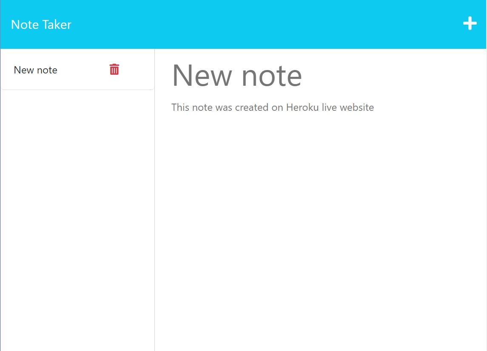

# Express.js: Note Taker
  

## Description
A Note Taker application that can be used to write and save notes. This application uses an Express.js back end and will save and retrieve note data from a JSON file. If you're a small business owner and want to be able to write and save notes so that you can organize your thoughts and keep track of tasks you need to complete, this perfectly executed product is for you!

## Table of Contents:
- [Description](#description)
- [Installation](#installation)
- [Usage](#usage)
- [License](#license)
- [How to Contribute](#how-to-contribute)
- [Tests](#tests)

## Installation
No installatio needed, just click on the link bellow.

## Usage
GIVEN a note-taking application:
WHEN you open the Note Taker
THEN you are presented with a landing page with a link to a notes page
WHEN you click on the link to the notes page
THEN you are presented with a page with existing notes listed in the left-hand column, plus empty fields to enter a new note title and the note’s text in the right-hand column
WHEN you enter a new note title and the note’s text
THEN a Save icon appears in the navigation at the top of the page
WHEN you click on the Save icon
THEN the new note you have entered is saved and appears in the left-hand column with the other existing notes
WHEN you click on an existing note in the list in the left-hand column
THEN that note appears in the right-hand column
WHEN you click on the Write icon in the navigation at the top of the page
THEN you are presented with empty fields to enter a new note title and the note’s text in the right-hand column

[Note Taker Live](https://expressjsnotetaker11.herokuapp.com/)

## License
MIT License

https://spdx.org/licenses/MIT.html

## How to Contribute
Feel free to modify any way you want, if you make good profit, dont forget to share :)

## Tests
N/A

## Questions
If you have any questions, you can reach me at:

Email: p.orest@gmail.com

or

GitHub: https://github.com/00rest

